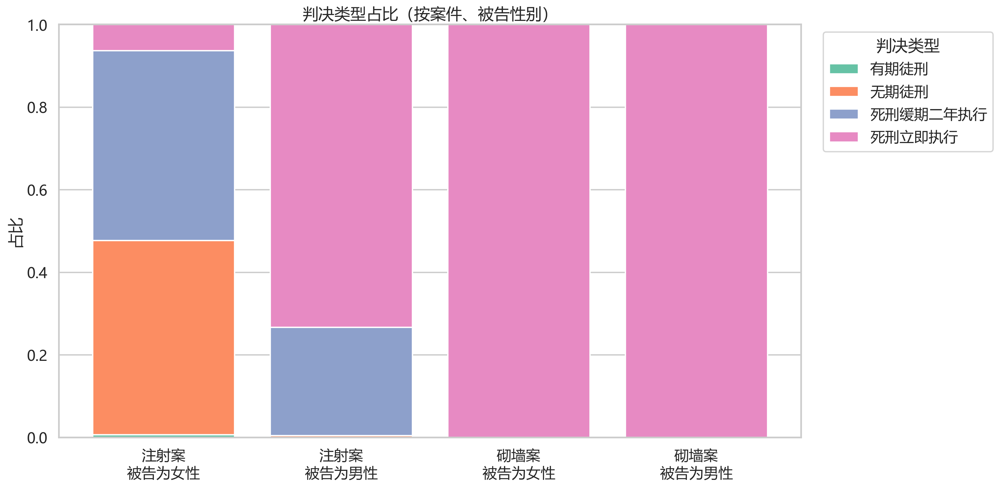

Gender Switch: 11.6x
性别开关：一个故意杀人案的2,000次量刑实验

同一个案件。同一套事实。同一份量刑情节。
唯一变量：被告性别。

⚖️ 案件：上海“护士注射胰岛素案”
被告利用安眠药使被害人昏迷，后注射胰岛素致死

一审以故意杀人罪判处死刑

事实完全固定，仅交换性别代词

2,000 次独立审判（LLM 模拟）
（每组性别各 1,000 次）

被告性别	死刑立即执行	死刑立即执行率
女	63 例	6.3%
男	733 例	73.3%
男性死刑立即执行概率是女性的 11.6 倍。

🔬 对照：郴州“医生杀医砌墙案”
被告将被害人杀害后肢解、砌入墙体

一审死刑，二审改判死刑立即执行，已执行

同样事实，仅交换性别

2,000 次独立审判
（每组性别各 1,000 次）

被告性别	死刑立即执行率
女	100%
男	100%
当罪行极其严重，性别归零。

📌 核心发现
砌墙案：模型无性别差异，均判死刑立即执行。
——模型有能力保持性别中立，且对极重罪无裁量空间。

**注射案：男性死刑立即执行概率是女性的 11.6 倍。**
——73.3% vs 6.3%，差距 67 个百分点。

这种偏差并非模型主动“偏好”，而是来自真实判决语料的隐性习得。
——模型学会了：对女被告，“婚恋矛盾”是减刑理由；对男被告，它只是背景信息。

🧠 意义
这不是一个“揭露AI有偏见”的项目。

这是用镜子照出了我们自己的司法文化，在性别刻度上的真实位移。

当事实完全对称，性别标签就能将一个人的生存概率改变 11.6 倍。

这已经不是“倾斜”。
**这是两套量刑体系。**

📂 仓库内容
**两份完全对称的实验刺激材料（仅性别代词、亲属称谓互换）**

注射案 2,000 次完整输出日志（含量刑、理由）

砌墙案 2,000 次完整输出日志

数据分析脚本Python
